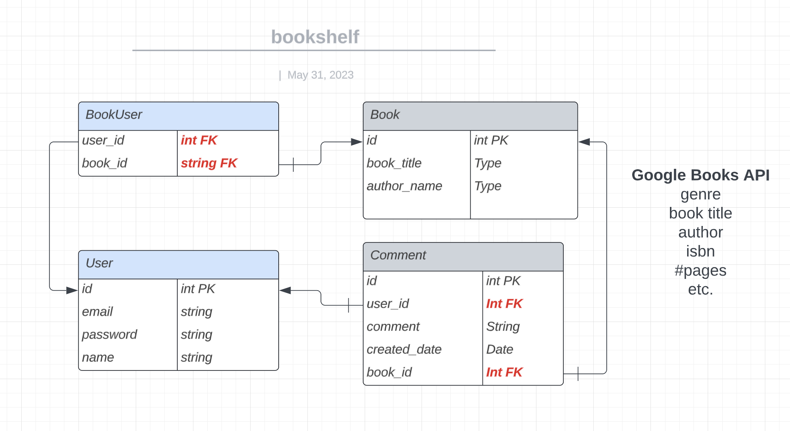

# BookWorm

Bookworm opens the doors to the places where you can find the book you’re looking for. This application allows users to read library books, save thier favorite books, and comment on books.

# Description

This application presents books displayed by genres for users to explore. Users must signup/login to be read book descriptions, track their favorite, and write and read comments. The app will authenticate user credentials and save their session and cookies. The app uses the following packages: express-handlebars as the template engine for the front end, MySQL and the Sequelize ORM for the database, and bcrypt package for passworrds, Node and Express to create a RESTful API. This app follows MVC methodology to relate the user front end to back end data models.


[](n/a)

# Git Hub Repository

https://github.com/TheColorHieu/BookWorm


# Heroku Deployed App

http://bookwormy.herokuapp.com/


# Screenshots

Visual for associations between 4 tables in the database: Book, Comment, User, BookUser

PK = Primary Key, FK = Foreign Key



Initial User Screen


## Table of Contents

[Installation & Usage](#installation--usage)

[User Story](#user-story)

[Acceptance Criteria](#acceptance-criteria)

# Collaborators

Shannon Hogeboom, Hieu Tran, Tifni Shroll

# Installation & Usage

Run from Heroku. 

To run on command line, do these steps:

1. Set up the environment by installing node package manager. If necessary, install packages seqelize and express

	* npm i 


2. Create the schema from the MySQL shell.

	* mysql
	* source {path}/schema.sql 
	* exit


3. Seed the database from the command line, OPTIONAL check of the contents of product table:

	* node ./seeds/seed.js
	* mysql

4. Start the server. Response is, "App listening on port 3001!"

	* node server.js


## User Story

```md
AS A reader who wants to browse books
I WANT a CMS-style book site
SO THAT I can browse through books by genre, create favorites, and make comments.
```


## Acceptance Criteria


```md
GIVEN a CMS-style book library site
WHEN I visit the site for the first time
THEN I am presented with the homepage, which includes book covers of books by genre; navigation links for the homepage and the dashboard; and the option to log in
WHEN I click on the homepage option
THEN I am taken to the homepage display of books
WHEN I click on any other links in the navigation
THEN I am prompted to either sign up or sign in
WHEN I choose to sign up
THEN I am prompted to create a username and password
WHEN I click on the sign-up button
THEN my user credentials are saved and I am logged into the site
WHEN I revisit the site at a later time and choose to sign in
THEN I am prompted to enter my username and password
WHEN I am signed in to the site
THEN I see navigation links for the homepage, the dashboard, and the option to log out
WHEN I click on the homepage option in the navigation
THEN I am taken to the homepage and presented with book covers that include the title and author
WHEN I click on a book title 
THEN I am presented with the book description, and any comments others have created, the creator’s username, and date created for that post and have the option to leave a comment
WHEN I enter a comment and click on the submit button while signed in
THEN the comment is saved and the book is updated to display the comment, the comment creator’s username, and the date created
WHEN I click on the dashboard option in the navigation
THEN I am taken to the dashboard and presented with book covers and any favorites I have marked along the side
WHEN I click on one of my existing posts in the dashboard
THEN I am able to delete or update my post and taken back to an updated dashboard
WHEN I click on the logout option in the navigation
THEN I am signed out of the site
WHEN I am idle on the site for more than a set time
THEN I am unable to view books and comments but I am prompted to log in again before I can add, update, or delete posts
```